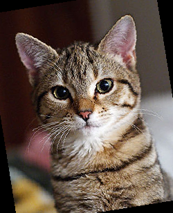
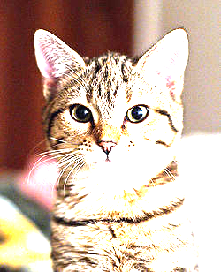
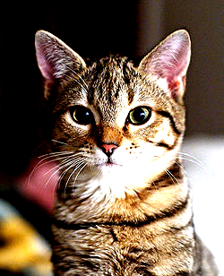
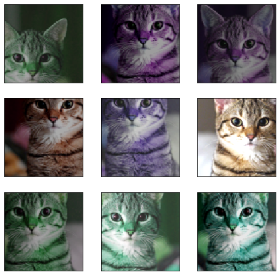

```python
import sys
sys.path.append('..')
from PIL import Image
from torchvision import transforms as tfs
```


```python
im = Image.open("cat.jpg")
im
```


```python
#Resize
print('Before scale, shape: {}'.format(im.size))
new_im = tfs.Resize((100,200))(im)
print('After scale, shape: {}'.format(new_im.size))
new_im
```

    Before scale, shape: (250, 308)
    After scale, shape: (200, 100)


```python
#Random Crop
random_im = tfs.RandomCrop(100)(im)#100*100
random_im
```


```python
#center crop
center_crop = tfs.CenterCrop(100)(im)
center_crop
```


```python
#Random Flip horizontal
h_flip = tfs.RandomHorizontalFlip()(im)
h_flip
#vertical
v_flip = tfs.RandomVerticalFlip()(im)
v_flip
#Random Rotation
rot_im = tfs.RandomRotation(40)(im)#-40-40
rot_im
```





```python
#brightness
bright_im = tfs.ColorJitter(2)(im)
bright_im
```





```python
#contrast
contrast_im = tfs.ColorJitter(contrast=2)(im)
contrast_im
```





```python
#Hue
hue_im = tfs.ColorJitter(hue = 0.5)(im)
hue_im
```


```python
#Composite
im_aug = tfs.Compose([
    tfs.Resize(120),
    tfs.RandomHorizontalFlip(),
    tfs.RandomCrop(90),
    tfs.ColorJitter(brightness=0.5,contrast=0.5,hue = 0.5)
])
```


```python
import matplotlib.pyplot as plt
%matplotlib inline
nrows = 3
ncols = 3
figsize = (8,8)
_,figs = plt.subplots(nrows, ncols, figsize = figsize)
for i in range(nrows):
    for j in range (ncols):
        figs[i][j].imshow(im_aug(im))
        figs[i][j].axes.get_xaxis().set_visible(False)
        figs[i][j].axes.get_yaxis().set_visible(False)
plt.show()
```





```python
#***Training Model Test***
import numpy as np
import torch
from torch import nn
import torch.nn.functional as F
from torch.autograd import Variable
from torchvision.datasets import CIFAR10
import torchvision 
from torchvision import transforms as tfs
from utils import train, resnet


#data augmented
def train_tf(x):
    im_aug = tfs.Compose([
        tfs.Resize(120),
        tfs.RandomHorizontalFlip(),
        tfs.RandomCrop(96),
        tfs.ColorJitter(brightness=0.5, contrast=0.5, hue=0.5),
        tfs.ToTensor(),
        tfs.Normalize([0.5, 0.5, 0.5], [0.5, 0.5, 0.5])
    ])
    x = im_aug(x)
    return x

def test_tf(x):
    im_aug = tfs.Compose([
        tfs.Resize(96),
        tfs.ToTensor(),
        tfs.Normalize([0.5, 0.5, 0.5], [0.5, 0.5, 0.5])
    ])
    x = im_aug(x)
    return x

train_set = CIFAR10('./data', train=True, transform=train_tf)
train_data = torch.utils.data.DataLoader(train_set, batch_size=64, shuffle=True)
test_set = CIFAR10('./data', train=False, transform=test_tf)
test_data = torch.utils.data.DataLoader(test_set, batch_size=128, shuffle=False)

net = resnet(3, 10)
optimizer = torch.optim.SGD(net.parameters(), lr=0.01)
criterion = nn.CrossEntropyLoss()
train(net, train_data, test_data, 10, optimizer, criterion)

```


   from __future__ import print_function, division

import torch
import torch.nn as nn
import torch.optim as optim
from torch.optim import lr_scheduler
import numpy as np
import torchvision
from torchvision import datasets, models, transforms
import matplotlib.pyplot as plt
import time
import os
import copy

plt.ion()   # interactive mode


# In[3]:


#Augmentation and normalization
#Just normalize for validation
data_tfs = {
    'train': transforms.Compose([
        transforms.RandomResizedCrop(224),
        transforms.RandomHorizontalFlip(),
        transforms.ToTensor(),
        transforms.Normalize([0.485,0.456,0.406],[0.229,0.224,0.225])
    ]),
    'val': transforms.Compose([
        transforms.Resize(256),
        transforms.CenterCrop(224),
        transforms.ToTensor(),
        transforms.Normalize([0.485, 0.456, 0.406], [0.229, 0.224, 0.225])
    ])
}

data_dir = 'data/hymenoptera_data'
image_datasets = {x: datasets.ImageFolder(os.path.join(data_dir, x),
                                          data_tfs[x])
                  for x in ['train','val']}
dataloaders = {x: torch.utils.data.DataLoader(image_datasets[x],batch_size = 4,
                                              shuffle = True, num_workers=4)
                  for x in ['train','val']}
dataset_sizes = {x: len(image_datasets[x]) for x in ['train','val']}
class_names = image_datasets['train'].classes

device = torch.device("cuda:0" if torch.cuda.is_available() else 'cpu')


# In[7]:


def imshow(inp, title = None):
    """Imshow for tensor"""
    inp = inp.numpy().transpose((1,2,0))
    mean = np.array([0.485, 0.456, 0.406])
    std = np.array([0.229, 0.224, 0.225])
    inp = std * inp + mean
    inp = np.clip(inp,0,1)
    plt.imshow(inp)
    if title is not None:
        plt.title(title)
    plt.pause(0.001)
    
#get a batch of training data
inputs, classes = next(iter(dataloaders['train']))

#Make a grid from batch
out = torchvision.utils.make_grid(inputs)

imshow(out, title=[class_names[x] for x in classes])


# In[19]:


def train_model(model, criterion, optimizer, scheduler, num_epoch=25):
    since = time.time()
    
    best_model_wts = copy.deepcopy(model.state_dict())
    best_acc = 0.0
    
    for epoch in range(num_epoch):
        print('Epoch{}/{}'.format(epoch,num_epoch-1))
        print('-'*10)
        
    #Each epoch in range(num_epochs):
        for phase in ['train','val']:
            if phase == 'train':
                scheduler.step()
                model.train() #Training mode
            else:
                model.eval() #Evaluation mode

            running_loss = 0.0
            running_corrects = 0

            #Iterate over data
            for inputs, labels in dataloaders[phase]:
                inputs = inputs.to(device)
                labels = labels.to(device)

                #zero the gradient
                optimizer.zero_grad()

                #forward
                #track history if only in train
                with torch.set_grad_enabled(phase == "train"):
                    outputs = model(inputs)
                    _, preds = torch.max(outputs, 1)
                    loss = criterion(outputs, labels)

                    #backward + optimize only if in training mode
                    if phase == 'train':
                        loss.backward()
                        optimizer.step()

                #stat
                    running_loss += loss.item() * inputs.size(0)
                    running_corrects += torch.sum(preds == labels.data)

                epoch_loss = running_loss / dataset_sizes[phase]
                epoch_acc = running_corrects.double() / dataset_sizes[phase]
                print('{}Loss: {:.4f} Acc: {:.4f}'.format(
                phase, epoch_loss, epoch_acc))

                #deep copy the model
                if phase == 'val' and epoch_acc > best_acc:
                    best_acc = epoch_acc
                    best_model_wts = copy.deepcopy(model.state_dict())
            print()

    time_elapsed = time.time() - since
    print('Training complete in {:.0f}m {:.0f}s'.format(
        time_elapsed // 60, time_elapsed % 60))
    print('Best val Acc: {:4f}'.format(best_acc))

    # load best model weights
    model.load_state_dict(best_model_wts)
    return model


# In[26]:


#Visualizing the model

def visualize_model(model, num_images=6):
    was_training = model.training
    model.eval()
    images_so_far = 0
    fig = plt.figure()

    with torch.no_grad():
        for i, (inputs, labels) in enumerate(dataloaders['val']):
            inputs = inputs.to(device)
            labels = labels.to(device)

            outputs = model(inputs)
            _, preds = torch.max(outputs, 1)

            for j in range(inputs.size()[0]):
                images_so_far += 1
                ax = plt.subplot(num_images//2, 2, images_so_far)
                ax.axis('off')
                ax.set_title('predicted: {}'.format(class_names[preds[j]]))
                imshow(inputs.cpu().data[j])

                if images_so_far == num_images:
                    model.train(mode=was_training)
                    return
        model.train(mode=was_training)


# In[21]:


#Finetuning the convet
model_ft = models.resnet18(pretrained=True)
num_ftrs = model_ft.fc.in_features
model_ft.fc = nn.Linear(num_ftrs, 2)

model_ft = model_ft.to(device)

criterion = nn.CrossEntropyLoss()

#Observe the parameters 
optimizer_ft = optim.SGD(model_ft.parameters(), lr = 0.001, momentum=0.9)

#Decay LR by a factor of 0.1 every 7 epochs
exp_lr_scheduler = lr_scheduler.StepLR(optimizer_ft, step_size=7,gamma=0.1)


# In[22]:


model_ft = train_model(model_ft, criterion, optimizer_ft,exp_lr_scheduler,num_epoch=25)


# In[27]:


visualize_model(model_ft)


# In[ ]:


```python

```
